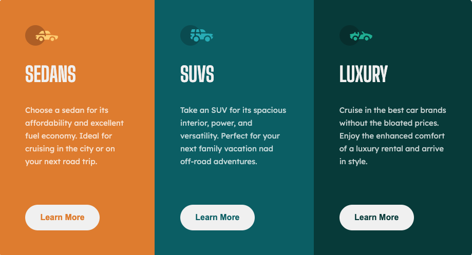

# Frontend Mentor - 3-column preview card component solution

This is a solution to the [3-column preview card component challenge on Frontend Mentor](https://www.frontendmentor.io/challenges/3column-preview-card-component-pH92eAR2-). Frontend Mentor challenges help you improve your coding skills by building realistic projects.

## Table of contents

- [Overview](#overview)
  - [The challenge](#the-challenge)
  - [Screenshot](#screenshot)
  - [Links](#links)
- [My process](#my-process)
  - [Built with](#built-with)
- [Author](#author)

## Overview

### The challenge

Users should be able to:

- View the optimal layout depending on their device's screen size
- See hover states for interactive elements

### Screenshot

### Links

- [Solution on Frontend Mentor](https://www.frontendmentor.io/solutions/3column-preview-card-using-react-and-styledcomponents-8IZuJNq3rC)
- [Live site](https://adam-winz-three-column-preview-card.netlify.app)
- [Code on github](https://github.com/adamwinzdesign/three_column_preview_card)

## My process

### Built with

- Flexbox
- Mobile-first workflow
- [React](https://reactjs.org/) - JS library
- [Styled Components](https://styled-components.com/) - For styles

## Author

- Profile on Github - [Github](https://github.com/adamwinzdesign)
- Profile on Frontend Mentor - [@adamwinzdesign](https://www.frontendmentor.io/profile/adamwinzdesign)
- Linkedin - [@adam-winzenburger](https://www.linkedin.com/in/adam-winzenburger/)
